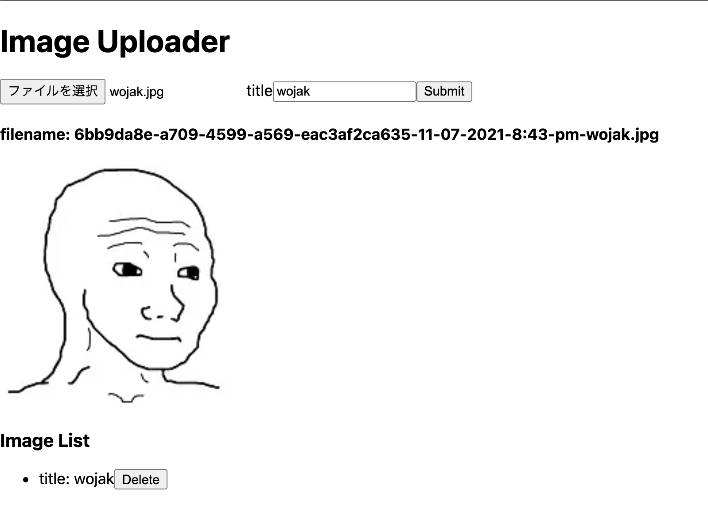

# Next image uploader

this is a simple file uploader. 
The image a user sent is gonna be sotored in /public/uploads folder in the server. then the image path and the date are gonna be stored in the database as reference.

